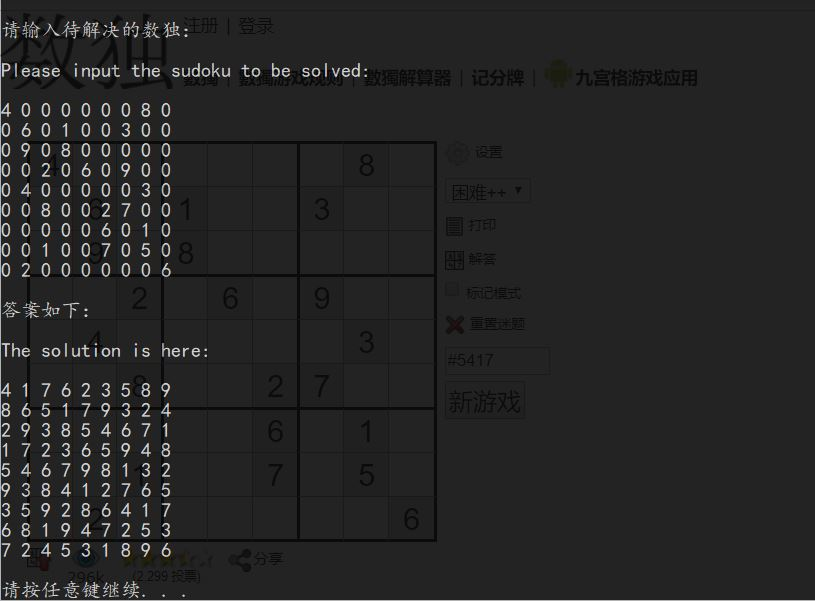

# 标准数独(Sudoku)(9*9)解题系统

[](../../graphs/commit-activity)
[](../../releases)

[](https://github.com/HollowMan6?tab=followers)
[](../../watchers)
[](../../stargazers)
[](../../network/members)

[](https://hollowman6.github.io/fund.html)
[](https://opensource.org/licenses/GPL-3.0/)
[](../../archive/master.zip)

这是一个用C编写的能智能解决数独问题的程序

下面是应用程序运行示例，使用一个每天能更新数独题目的[网站](http://www.sudoku.name)的题目：


->


这是程序给出的解答：


你也可以通过固定的提供格式将题目存在文件中，使用命令从而解题。一个示例如下：

使用命令：

```Shell
Standard-Sudoku-Solve-System < example.txt > example-output.txt
```

结果：

[example.txt](Test/example.txt)

[example-output.txt](Test/example-output.txt)

# Standard Sudoku Solve System

This is a program coded by C gives you the solution to a specific Sudoku.

Here is the example provided, using the question on the [website](http://www.sudoku.name) that gives you Sudoku Problems every day:


->


Here is the solution given by program:


You can also solve the problem that saved in the file with the format provided.

An example runned by the command:

```Shell
Standard-Sudoku-Solve-System < example.txt > example-output.txt
```

The result:

[example.txt](Test/example.txt)

[example-output.txt](Test/example-output.txt)
