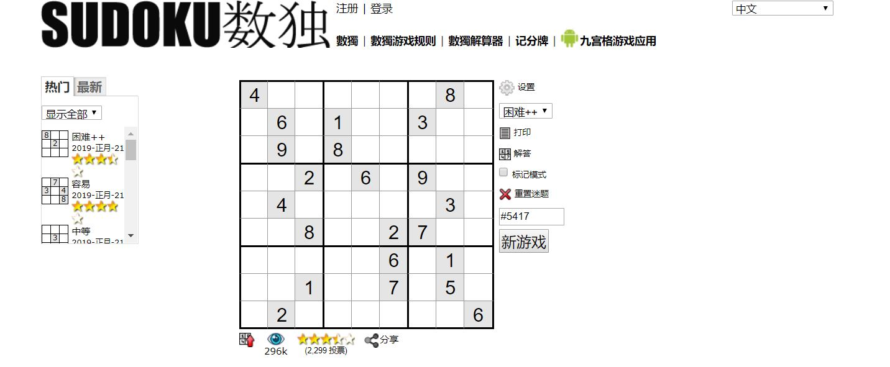
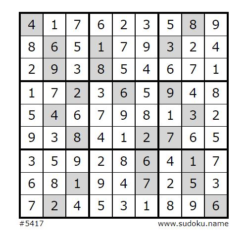
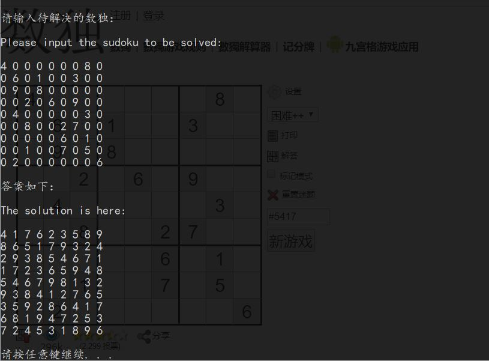

# Standard-Sudoku-Solve-System
# 标准数独(Sudoku)(9*9)解题系统

This is a program coded by C gives you the solution to a specific Sudoku.

Here is the [website（推荐网站）](http://www.sudoku.name) that I recommend gives you Sudoku Problems every day. 

下面是应用程序运行示例：

Here is the example provided:

->

Here is the solution given by program:

You can also solve the problem that saved in the file with the format provided.

And again, an example runned by the command "Standard-Sudoku-Solve-System < example.txt > example-output.txt"
[example.txt](example.txt)
[example-output.txt](example-output.txt)
